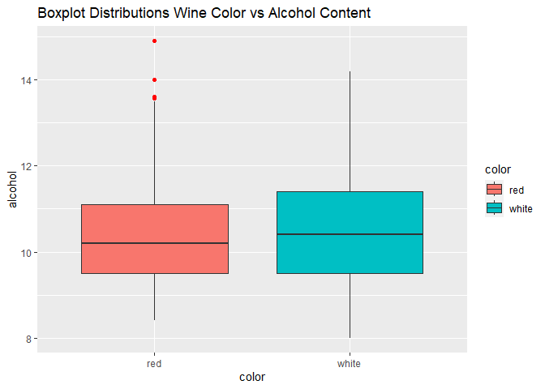
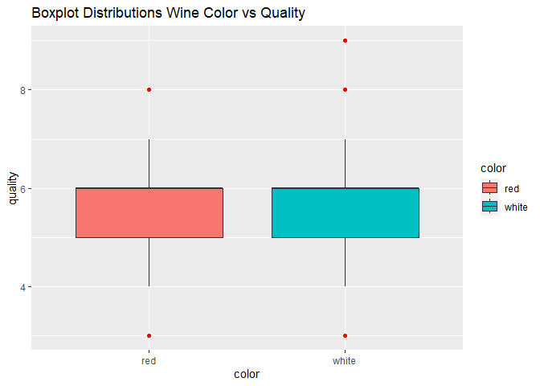
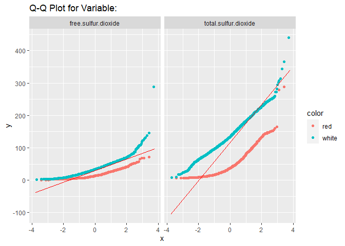
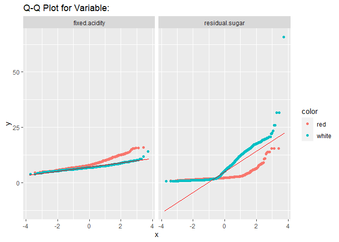
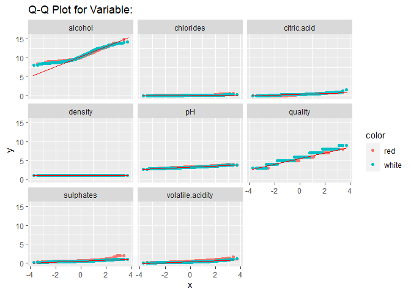

Project 2
================
Bao Dang

**1. Load the two data sets into R**

``` r
library(readxl) # part of tidyverse
```

``` r
quality_red.csv = read.csv("C:\\Users\\I566801\\OneDrive - SAP SE\\Documents\\Drexel\\MATH 318\\Week 4\\winequality-red.csv", sep = ";")
```

``` r
quality_white.csv = read.csv("C:\\Users\\I566801\\OneDrive - SAP SE\\Documents\\Drexel\\MATH 318\\Week 4\\winequality-white.csv", sep = ";")
```

**2. Transform data frames to tibble format**

``` r
library(tidyverse)
```

    ## ── Attaching packages ─────────────────────────────────────── tidyverse 1.3.2 ──
    ## ✔ ggplot2 3.4.0      ✔ purrr   1.0.1 
    ## ✔ tibble  3.1.8      ✔ dplyr   1.0.10
    ## ✔ tidyr   1.2.1      ✔ stringr 1.5.0 
    ## ✔ readr   2.1.3      ✔ forcats 0.5.2 
    ## ── Conflicts ────────────────────────────────────────── tidyverse_conflicts() ──
    ## ✖ dplyr::filter() masks stats::filter()
    ## ✖ dplyr::lag()    masks stats::lag()

``` r
quality_red.df = as_tibble(quality_red.csv) # casts to tibble type
#print(quality_red.df)
```

``` r
quality_white.df = as_tibble(quality_white.csv) # casts to tibble type
#print(quality_white.df)
```

**3. Add a column to each data frame**

``` r
quality_red.df = add_column(quality_red.df, color = "red")
```

``` r
quality_white.df = add_column(quality_white.df, color = "white")
```

**4. Join the two data frames into a single data frame**

``` r
wine_quality.df = union_all(quality_red.df, quality_white.df)
print(wine_quality.df)
```

    ## # A tibble: 6,497 × 13
    ##    fixed…¹ volat…² citri…³ resid…⁴ chlor…⁵ free.…⁶ total…⁷ density    pH sulph…⁸
    ##      <dbl>   <dbl>   <dbl>   <dbl>   <dbl>   <dbl>   <dbl>   <dbl> <dbl>   <dbl>
    ##  1     7.4    0.7     0        1.9   0.076      11      34   0.998  3.51    0.56
    ##  2     7.8    0.88    0        2.6   0.098      25      67   0.997  3.2     0.68
    ##  3     7.8    0.76    0.04     2.3   0.092      15      54   0.997  3.26    0.65
    ##  4    11.2    0.28    0.56     1.9   0.075      17      60   0.998  3.16    0.58
    ##  5     7.4    0.7     0        1.9   0.076      11      34   0.998  3.51    0.56
    ##  6     7.4    0.66    0        1.8   0.075      13      40   0.998  3.51    0.56
    ##  7     7.9    0.6     0.06     1.6   0.069      15      59   0.996  3.3     0.46
    ##  8     7.3    0.65    0        1.2   0.065      15      21   0.995  3.39    0.47
    ##  9     7.8    0.58    0.02     2     0.073       9      18   0.997  3.36    0.57
    ## 10     7.5    0.5     0.36     6.1   0.071      17     102   0.998  3.35    0.8 
    ## # … with 6,487 more rows, 3 more variables: alcohol <dbl>, quality <int>,
    ## #   color <chr>, and abbreviated variable names ¹​fixed.acidity,
    ## #   ²​volatile.acidity, ³​citric.acid, ⁴​residual.sugar, ⁵​chlorides,
    ## #   ⁶​free.sulfur.dioxide, ⁷​total.sulfur.dioxide, ⁸​sulphates

**5. Change the color column to be of factor type**

``` r
wine_quality.df$color = factor(wine_quality.df$color)
#print(wine_quality.df)
```

**6. What are the variables in the data set? How many observations are
there?**

- There are 13 variables in the data set (including the newly added
  column “color”).

- There are 6,497 observations in the data set after combining the two
  smaller data sets.

**7. Compute summary statistics for the entire data set**

``` r
summary(wine_quality.df)
```

    ##  fixed.acidity    volatile.acidity  citric.acid     residual.sugar  
    ##  Min.   : 3.800   Min.   :0.0800   Min.   :0.0000   Min.   : 0.600  
    ##  1st Qu.: 6.400   1st Qu.:0.2300   1st Qu.:0.2500   1st Qu.: 1.800  
    ##  Median : 7.000   Median :0.2900   Median :0.3100   Median : 3.000  
    ##  Mean   : 7.215   Mean   :0.3397   Mean   :0.3186   Mean   : 5.443  
    ##  3rd Qu.: 7.700   3rd Qu.:0.4000   3rd Qu.:0.3900   3rd Qu.: 8.100  
    ##  Max.   :15.900   Max.   :1.5800   Max.   :1.6600   Max.   :65.800  
    ##    chlorides       free.sulfur.dioxide total.sulfur.dioxide    density      
    ##  Min.   :0.00900   Min.   :  1.00      Min.   :  6.0        Min.   :0.9871  
    ##  1st Qu.:0.03800   1st Qu.: 17.00      1st Qu.: 77.0        1st Qu.:0.9923  
    ##  Median :0.04700   Median : 29.00      Median :118.0        Median :0.9949  
    ##  Mean   :0.05603   Mean   : 30.53      Mean   :115.7        Mean   :0.9947  
    ##  3rd Qu.:0.06500   3rd Qu.: 41.00      3rd Qu.:156.0        3rd Qu.:0.9970  
    ##  Max.   :0.61100   Max.   :289.00      Max.   :440.0        Max.   :1.0390  
    ##        pH          sulphates         alcohol         quality        color     
    ##  Min.   :2.720   Min.   :0.2200   Min.   : 8.00   Min.   :3.000   red  :1599  
    ##  1st Qu.:3.110   1st Qu.:0.4300   1st Qu.: 9.50   1st Qu.:5.000   white:4898  
    ##  Median :3.210   Median :0.5100   Median :10.30   Median :6.000               
    ##  Mean   :3.219   Mean   :0.5313   Mean   :10.49   Mean   :5.818               
    ##  3rd Qu.:3.320   3rd Qu.:0.6000   3rd Qu.:11.30   3rd Qu.:6.000               
    ##  Max.   :4.010   Max.   :2.0000   Max.   :14.90   Max.   :9.000

8\. **Using filter (from dplyr) to obtain the summary statistics just
for whites and just for reds.**

Summary just for reds:

``` r
wine_quality_red.subset <- filter(wine_quality.df, wine_quality.df$color=="red")
```

``` r
summary(wine_quality_red.subset)
```

    ##  fixed.acidity   volatile.acidity  citric.acid    residual.sugar  
    ##  Min.   : 4.60   Min.   :0.1200   Min.   :0.000   Min.   : 0.900  
    ##  1st Qu.: 7.10   1st Qu.:0.3900   1st Qu.:0.090   1st Qu.: 1.900  
    ##  Median : 7.90   Median :0.5200   Median :0.260   Median : 2.200  
    ##  Mean   : 8.32   Mean   :0.5278   Mean   :0.271   Mean   : 2.539  
    ##  3rd Qu.: 9.20   3rd Qu.:0.6400   3rd Qu.:0.420   3rd Qu.: 2.600  
    ##  Max.   :15.90   Max.   :1.5800   Max.   :1.000   Max.   :15.500  
    ##    chlorides       free.sulfur.dioxide total.sulfur.dioxide    density      
    ##  Min.   :0.01200   Min.   : 1.00       Min.   :  6.00       Min.   :0.9901  
    ##  1st Qu.:0.07000   1st Qu.: 7.00       1st Qu.: 22.00       1st Qu.:0.9956  
    ##  Median :0.07900   Median :14.00       Median : 38.00       Median :0.9968  
    ##  Mean   :0.08747   Mean   :15.87       Mean   : 46.47       Mean   :0.9967  
    ##  3rd Qu.:0.09000   3rd Qu.:21.00       3rd Qu.: 62.00       3rd Qu.:0.9978  
    ##  Max.   :0.61100   Max.   :72.00       Max.   :289.00       Max.   :1.0037  
    ##        pH          sulphates         alcohol         quality        color     
    ##  Min.   :2.740   Min.   :0.3300   Min.   : 8.40   Min.   :3.000   red  :1599  
    ##  1st Qu.:3.210   1st Qu.:0.5500   1st Qu.: 9.50   1st Qu.:5.000   white:   0  
    ##  Median :3.310   Median :0.6200   Median :10.20   Median :6.000               
    ##  Mean   :3.311   Mean   :0.6581   Mean   :10.42   Mean   :5.636               
    ##  3rd Qu.:3.400   3rd Qu.:0.7300   3rd Qu.:11.10   3rd Qu.:6.000               
    ##  Max.   :4.010   Max.   :2.0000   Max.   :14.90   Max.   :8.000

Summary just for whites:

``` r
wine_quality_white.subset <- filter(wine_quality.df, wine_quality.df$color=="white")
```

``` r
summary(wine_quality_white.subset)
```

    ##  fixed.acidity    volatile.acidity  citric.acid     residual.sugar  
    ##  Min.   : 3.800   Min.   :0.0800   Min.   :0.0000   Min.   : 0.600  
    ##  1st Qu.: 6.300   1st Qu.:0.2100   1st Qu.:0.2700   1st Qu.: 1.700  
    ##  Median : 6.800   Median :0.2600   Median :0.3200   Median : 5.200  
    ##  Mean   : 6.855   Mean   :0.2782   Mean   :0.3342   Mean   : 6.391  
    ##  3rd Qu.: 7.300   3rd Qu.:0.3200   3rd Qu.:0.3900   3rd Qu.: 9.900  
    ##  Max.   :14.200   Max.   :1.1000   Max.   :1.6600   Max.   :65.800  
    ##    chlorides       free.sulfur.dioxide total.sulfur.dioxide    density      
    ##  Min.   :0.00900   Min.   :  2.00      Min.   :  9.0        Min.   :0.9871  
    ##  1st Qu.:0.03600   1st Qu.: 23.00      1st Qu.:108.0        1st Qu.:0.9917  
    ##  Median :0.04300   Median : 34.00      Median :134.0        Median :0.9937  
    ##  Mean   :0.04577   Mean   : 35.31      Mean   :138.4        Mean   :0.9940  
    ##  3rd Qu.:0.05000   3rd Qu.: 46.00      3rd Qu.:167.0        3rd Qu.:0.9961  
    ##  Max.   :0.34600   Max.   :289.00      Max.   :440.0        Max.   :1.0390  
    ##        pH          sulphates         alcohol         quality        color     
    ##  Min.   :2.720   Min.   :0.2200   Min.   : 8.00   Min.   :3.000   red  :   0  
    ##  1st Qu.:3.090   1st Qu.:0.4100   1st Qu.: 9.50   1st Qu.:5.000   white:4898  
    ##  Median :3.180   Median :0.4700   Median :10.40   Median :6.000               
    ##  Mean   :3.188   Mean   :0.4898   Mean   :10.51   Mean   :5.878               
    ##  3rd Qu.:3.280   3rd Qu.:0.5500   3rd Qu.:11.40   3rd Qu.:6.000               
    ##  Max.   :3.820   Max.   :1.0800   Max.   :14.20   Max.   :9.000

**9. Discuss the summary statistics. Is the typical white wine lower or
higher quality than the typical red. Does the typical white wine have
lower or higher alcohol content than the typical red?**

Red wine summary statistics  
- The variable “alcohol” ranges from 8.4 to 14.9, with a mean of 10.42
  and a median of 10.2.

- The variable “quality” ranges from 3 to 8, with a mean of 5.636 and a
  median of 6.

White wine summary statistics  
- The variable “alcohol” ranges from 8 to 14.2, with a mean of 10.51 and
  a median of 10.4.

- The variable “quality” ranges from 3 to 9, with a mean of 5.878 and a
  median of 6.

On average, we can see that white wine has slightly higher alcohol
content than red wine (10.51\>10.42). White wine also has better quality
comparing to red wine on average (5.878\>5.636).

**10.** **Explain your answers using box plots for quality and alcohol
content variables.**

Same insights can be drawn from the box plots from the summary
statistics discussion above.

``` r
ggplot(wine_quality.df, aes(x=color, y=alcohol, fill=color)) + geom_boxplot(outlier.colour = "red") +  ggtitle("Boxplot Distributions Wine Color vs Alcohol Content")
```

<!-- -->

``` r
ggplot(wine_quality.df, aes(x=color, y=quality, fill=color)) + geom_boxplot(outlier.colour = "red") + ggtitle("Boxplot Distributions Wine Color vs Quality")
```

<!-- -->

**11. Use gather from tidyr so that each numerical variable is a single
row; retain the color variable so that the data can be split up by
color**

``` r
wine_quality_long = gather(wine_quality.df, key=variable, value, -color)
wine_quality_long
```

    ## # A tibble: 77,964 × 3
    ##    color variable      value
    ##    <fct> <chr>         <dbl>
    ##  1 red   fixed.acidity   7.4
    ##  2 red   fixed.acidity   7.8
    ##  3 red   fixed.acidity   7.8
    ##  4 red   fixed.acidity  11.2
    ##  5 red   fixed.acidity   7.4
    ##  6 red   fixed.acidity   7.4
    ##  7 red   fixed.acidity   7.9
    ##  8 red   fixed.acidity   7.3
    ##  9 red   fixed.acidity   7.8
    ## 10 red   fixed.acidity   7.5
    ## # … with 77,954 more rows

Filter “free.sulfur.dioxide” and “total.sulfur.dioxide” from the data
frame.

``` r
wine_quality_long_1 = filter(wine_quality_long, variable == "free.sulfur.dioxide" | variable == "total.sulfur.dioxide")
#wine_quality_long_1
```

Filter “fixed.acidity” and “residual.sugar” from the data frame.

``` r
wine_quality_long_2 = filter(wine_quality_long, variable == "fixed.acidity" | variable == "residual.sugar")
#wine_quality_long_2
```

Data frame excluding the numerical variables filtered out above.

``` r
wine_quality_long_3 = filter(wine_quality_long, variable != "free.sulfur.dioxide" & variable != "total.sulfur.dioxide" &  variable != "fixed.acidity" &  variable != "residual.sugar")
#wine_quality_long_3
```

**12. Use geom qq together with facet wrap or facet grid to produce QQ
plots of the numerical variables, split by wine color. Do any of the
numerical variables (obviously excluding wine color) appear to be
normally distributed?**

- Most data points fall off the reference line for both variables
  **“free.sulfur.dioxide”** and **“total.sulfur.dioxide”** **of both
  colors;** therefore, the two variables **are** **not normally
  distributed.**

``` r
ggplot(data=wine_quality_long_1, aes(sample=value, color=color)) + geom_qq() + facet_wrap(~variable) + geom_qq_line(color="red") + ggtitle("Q-Q Plot for Variable:")
```

<!-- -->

- Variable **“fixed.acidity”:**

  - Most of the points from **red wine** data frame fall off the
    reference line; therefore, the variable **is** **not normally
    distributed.**

  - Most of the points from **white wine** data frame fall approximately
    along the reference line, we can **assume normality** for the
    variable.

- Variable **“residual.sugar”:**

  - Most data points **of both colors** fall off the reference line;
    therefore, the variables **is** **not normally distributed.**

``` r
ggplot(data=wine_quality_long_2, aes(sample=value, color=color)) + geom_qq() + facet_wrap(~variable) + geom_qq_line(color="red") + ggtitle("Q-Q Plot for Variable:")
```

<!-- -->

- Variable **“alcohol”:**

  - Despite having many data points **of both colors** fall along the
    reference line, the number of points falling off the reference line
    is also significant; therefore, the variable is expected to be **not
    normally distributed.**

- Variable **“chlorides”, “citric.acid”, “density”, “pH”, “quality”,
  “sulphates”, “volatile.acidity”:**

  - Most of the points from the data frame of both colors fall
    approximately along the reference line, we can **assume normality**
    for all these variables.

``` r
ggplot(data=wine_quality_long_3, aes(sample=value, color=color)) + geom_qq() + facet_wrap(~variable) + geom_qq_line(color="red") + ggtitle("Q-Q Plot for Variable:")
```

<!-- -->
