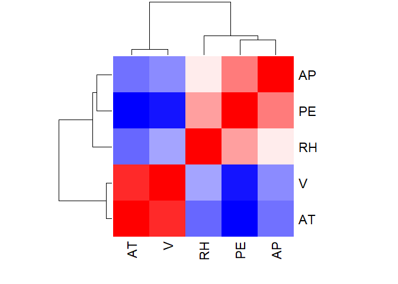
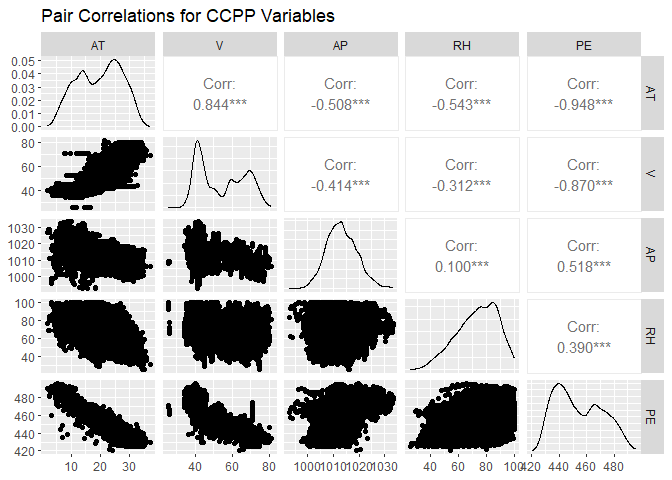
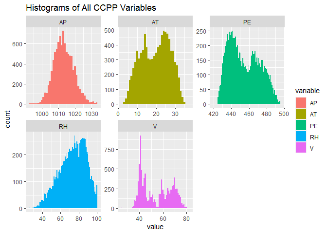
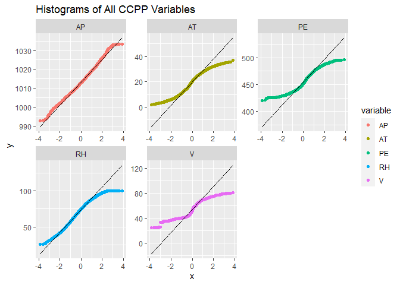
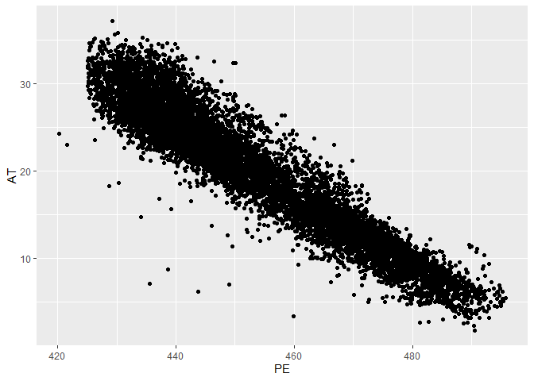

Homework 3 - MATH 318
================
Bao Dang

#### 1. Briefly summarize what the data set reports

The dataset contains 9568 data points collected from a Combined Cycle
Power Plant (CCPP) over 6 years (2006-2011) with hourly average ambient
variables: Temperature (AT), Pressure (AP), Relative Humidity (RH), and
Exhaust Vacuum (V), to predict the energy output of the plan (PE).

The CCPP generates electricity using gas and steam turbines (GT and ST)
that work in combination, with the output from one turbine being
transferred to another.

The vacuum variable is collected from and has an effect on the steam
turbine, while the other three ambient variables (temperature, ambient
pressure, and relative humidity) affect the performance of the gas
turbines.

#### 2. Compute the pairwise correlations amongst the variables

``` r
library(readxl)
library(tidyverse)
```

    ## ── Attaching packages ─────────────────────────────────────── tidyverse 1.3.2 ──
    ## ✔ ggplot2 3.4.0      ✔ purrr   1.0.1 
    ## ✔ tibble  3.1.8      ✔ dplyr   1.0.10
    ## ✔ tidyr   1.2.1      ✔ stringr 1.5.0 
    ## ✔ readr   2.1.3      ✔ forcats 0.5.2 
    ## ── Conflicts ────────────────────────────────────────── tidyverse_conflicts() ──
    ## ✖ dplyr::filter() masks stats::filter()
    ## ✖ dplyr::lag()    masks stats::lag()

``` r
library(kableExtra)
```

    ## 
    ## Attaching package: 'kableExtra'
    ## 
    ## The following object is masked from 'package:dplyr':
    ## 
    ##     group_rows

``` r
hw3.xlsx = read_excel("C:\\Users\\I566801\\OneDrive - SAP SE\\Documents\\Drexel\\MATH 318\\Homework 3\\Folds5x2_pp.xlsx")
```

``` r
hw3.df = as_tibble(hw3.xlsx) # casts to tibble type
print(hw3.df)
```

    ## # A tibble: 9,568 × 5
    ##       AT     V    AP    RH    PE
    ##    <dbl> <dbl> <dbl> <dbl> <dbl>
    ##  1 15.0   41.8 1024.  73.2  463.
    ##  2 25.2   63.0 1020.  59.1  444.
    ##  3  5.11  39.4 1012.  92.1  489.
    ##  4 20.9   57.3 1010.  76.6  446.
    ##  5 10.8   37.5 1009.  96.6  474.
    ##  6 26.3   59.4 1012.  58.8  444.
    ##  7 15.9   44.0 1014.  75.2  467.
    ##  8  9.48  44.7 1019.  66.4  478.
    ##  9 14.6   45   1022.  41.2  476.
    ## 10 11.7   43.6 1015.  70.7  478.
    ## # … with 9,558 more rows

``` r
correlations = cor(hw3.df)
```

Table of the cross correlations

``` r
kb <- kable(correlations, caption="Cross Correlations")
kable_styling(kb, bootstrap_options = "striped")
```

<table class="table table-striped" style="margin-left: auto; margin-right: auto;">
<caption>
Cross Correlations
</caption>
<thead>
<tr>
<th style="text-align:left;">
</th>
<th style="text-align:right;">
AT
</th>
<th style="text-align:right;">
V
</th>
<th style="text-align:right;">
AP
</th>
<th style="text-align:right;">
RH
</th>
<th style="text-align:right;">
PE
</th>
</tr>
</thead>
<tbody>
<tr>
<td style="text-align:left;">
AT
</td>
<td style="text-align:right;">
1.0000000
</td>
<td style="text-align:right;">
0.8441067
</td>
<td style="text-align:right;">
-0.5075493
</td>
<td style="text-align:right;">
-0.5425347
</td>
<td style="text-align:right;">
-0.9481285
</td>
</tr>
<tr>
<td style="text-align:left;">
V
</td>
<td style="text-align:right;">
0.8441067
</td>
<td style="text-align:right;">
1.0000000
</td>
<td style="text-align:right;">
-0.4135022
</td>
<td style="text-align:right;">
-0.3121873
</td>
<td style="text-align:right;">
-0.8697803
</td>
</tr>
<tr>
<td style="text-align:left;">
AP
</td>
<td style="text-align:right;">
-0.5075493
</td>
<td style="text-align:right;">
-0.4135022
</td>
<td style="text-align:right;">
1.0000000
</td>
<td style="text-align:right;">
0.0995743
</td>
<td style="text-align:right;">
0.5184290
</td>
</tr>
<tr>
<td style="text-align:left;">
RH
</td>
<td style="text-align:right;">
-0.5425347
</td>
<td style="text-align:right;">
-0.3121873
</td>
<td style="text-align:right;">
0.0995743
</td>
<td style="text-align:right;">
1.0000000
</td>
<td style="text-align:right;">
0.3897941
</td>
</tr>
<tr>
<td style="text-align:left;">
PE
</td>
<td style="text-align:right;">
-0.9481285
</td>
<td style="text-align:right;">
-0.8697803
</td>
<td style="text-align:right;">
0.5184290
</td>
<td style="text-align:right;">
0.3897941
</td>
<td style="text-align:right;">
1.0000000
</td>
</tr>
</tbody>
</table>

Plot the heatmap of the correlation:

``` r
heatmap(correlations, 
        col = colorRampPalette(c("blue", "white", "red"))(100), 
        scale = "none")
```

<!-- -->

#### 3. Plot the pairwise scatter plots using the GGally package

``` r
library(GGally)
```

    ## Registered S3 method overwritten by 'GGally':
    ##   method from   
    ##   +.gg   ggplot2

``` r
plt <- ggpairs(hw3.df) + ggtitle("Pair Correlations for CCPP Variables")
print(plt)
```

<!-- -->

#### 4. Which variables are most strongly correlated? Describe the relationships

The correlation matrix indicates that the temperature (AT) and exhaust
vacuum (V) are strongly negatively correlated with the target energy
output (PE), with correlation coefficients of approximately -0.95 and
-0.87, respectively.

Conversely, pressure (AP) and relative humidity (RH) exhibit a weak
positive correlation with energy output (PE), with correlation
coefficients of approximately 0.52 and 0.39.

It can be observed that temperature (AT) and exhaust vacuum (V) are
strongly positively correlated with each other.

#### 5. Looking at histograms of the variables, do any of them appear to be normally distributed?

Use gather() from tidyr so that each numerical variable is a single row

``` r
hw3_long <- gather(hw3.df, key = "variable", value)
hw3_long
```

    ## # A tibble: 47,840 × 2
    ##    variable value
    ##    <chr>    <dbl>
    ##  1 AT       15.0 
    ##  2 AT       25.2 
    ##  3 AT        5.11
    ##  4 AT       20.9 
    ##  5 AT       10.8 
    ##  6 AT       26.3 
    ##  7 AT       15.9 
    ##  8 AT        9.48
    ##  9 AT       14.6 
    ## 10 AT       11.7 
    ## # … with 47,830 more rows

``` r
gplt <- ggplot(hw3_long, aes(x=value, fill=variable))
gplt <- gplt+geom_histogram(binwidth = 1)
gplt <- gplt+facet_wrap(~variable, scales = "free")
gplt <- gplt+ ggtitle("Histograms of All CCPP Variables")
print(gplt)
```

<!-- -->

By looking at the histogram, ambient pressure variable (AP) appears to
be normally distributed.

We want to double check by plotting QQ Plots of the variables:

``` r
gplt <- ggplot(hw3_long, aes(sample=value, color=variable))
gplt <- gplt+geom_qq()
gplt <- gplt+facet_wrap(~variable, scales = "free")
gplt <- gplt+geom_qq_line(color="black")
gplt <- gplt+ ggtitle("Histograms of All CCPP Variables")
print(gplt)
```

<!-- -->

The QQ Plots confirm the ambient pressure variable (AP) is normally
distributed.

#### 6. Thinking of the PE variable as the response variable, identify the three most closely correlated predictors.

``` r
cor.df <- as_tibble(correlations)
```

``` r
abs_cor_vals <- abs(cor.df$PE)
top_3_indices <- head(order(abs_cor_vals, decreasing = TRUE), 4)[-1] 
# order function used to get the indices of the sorted values in descending order
# [-1] removes the first element from the sorted vector
top_3_names <- names(cor.df)[top_3_indices]
top_3_names
```

    ## [1] "AT" "V"  "AP"

By sorting, we learn that AT, V, AP are the three most closely
correlated predictors (in order).

#### 7. Perform three multilinear regressions, regressing first against the most strongly correlated variable, then the two most strongly correlated variables, and finally against the three most strongly variables.

1.  Linear regression model to predict the “PE” (power output) response
    variable using the “AT” (ambient temperature) variable:

``` r
ccpp_lm_1 <- lm(PE~AT, data=hw3.df)
summary(ccpp_lm_1)
```

    ## 
    ## Call:
    ## lm(formula = PE ~ AT, data = hw3.df)
    ## 
    ## Residuals:
    ##     Min      1Q  Median      3Q     Max 
    ## -45.951  -3.644   0.101   3.696  23.251 
    ## 
    ## Coefficients:
    ##               Estimate Std. Error t value Pr(>|t|)    
    ## (Intercept) 497.034120   0.156434  3177.3   <2e-16 ***
    ## AT           -2.171320   0.007443  -291.7   <2e-16 ***
    ## ---
    ## Signif. codes:  0 '***' 0.001 '**' 0.01 '*' 0.05 '.' 0.1 ' ' 1
    ## 
    ## Residual standard error: 5.426 on 9566 degrees of freedom
    ## Multiple R-squared:  0.8989, Adjusted R-squared:  0.8989 
    ## F-statistic: 8.51e+04 on 1 and 9566 DF,  p-value: < 2.2e-16

2.  Multiple linear regression model with the response variable PE and
    the predictor variables AT, and V:

``` r
ccpp_lm_2 <- lm(PE~AT+V, data=hw3.df)
summary(ccpp_lm_2)
```

    ## 
    ## Call:
    ## lm(formula = PE ~ AT + V, data = hw3.df)
    ## 
    ## Residuals:
    ##     Min      1Q  Median      3Q     Max 
    ## -44.354  -3.343  -0.084   3.276  19.849 
    ## 
    ## Coefficients:
    ##               Estimate Std. Error t value Pr(>|t|)    
    ## (Intercept) 505.477434   0.240491 2101.86   <2e-16 ***
    ## AT           -1.704266   0.012678 -134.43   <2e-16 ***
    ## V            -0.324487   0.007435  -43.64   <2e-16 ***
    ## ---
    ## Signif. codes:  0 '***' 0.001 '**' 0.01 '*' 0.05 '.' 0.1 ' ' 1
    ## 
    ## Residual standard error: 4.955 on 9565 degrees of freedom
    ## Multiple R-squared:  0.9157, Adjusted R-squared:  0.9157 
    ## F-statistic: 5.197e+04 on 2 and 9565 DF,  p-value: < 2.2e-16

3.  Multiple linear regression model with the response variable PE and
    the predictor variables AT, V, and AP

``` r
ccpp_lm_3 <- lm(PE~AT+V+AP, data=hw3.df)
summary(ccpp_lm_3)
```

    ## 
    ## Call:
    ## lm(formula = PE ~ AT + V + AP, data = hw3.df)
    ## 
    ## Residuals:
    ##     Min      1Q  Median      3Q     Max 
    ## -44.063  -3.440  -0.073   3.319  19.449 
    ## 
    ## Coefficients:
    ##               Estimate Std. Error t value Pr(>|t|)    
    ## (Intercept) 344.071387   9.976759   34.49   <2e-16 ***
    ## AT           -1.634777   0.013225 -123.61   <2e-16 ***
    ## V            -0.328323   0.007339  -44.73   <2e-16 ***
    ## AP            0.158152   0.009773   16.18   <2e-16 ***
    ## ---
    ## Signif. codes:  0 '***' 0.001 '**' 0.01 '*' 0.05 '.' 0.1 ' ' 1
    ## 
    ## Residual standard error: 4.889 on 9564 degrees of freedom
    ## Multiple R-squared:  0.918,  Adjusted R-squared:  0.9179 
    ## F-statistic: 3.568e+04 on 3 and 9564 DF,  p-value: < 2.2e-16

#### 8. Discuss the goodness of fit for these three models, in terms of the p values of the regressed coefficients and R2. Use tables in your presentation where helpful.

All three models have significant small p values (p \< 0.05).

Model 1 has an R-squared value of 0.8989.

Model 2, which includes another variable, V, has a higher R-squared
value of 0.9157.

Model 3, which includes another variable, AP, has an R-squared value of
0.918, slightly higher than the R-squared value of the second model.

Overall, all three models have good goodness of fit, with high R-squared
values and p values. However, the third model is slightly better than
the first and second model in terms of model fit, with a higher
R-squared value and lower p value.

``` r
plt <- ggplot(hw3.df, aes(x=PE, y=AT)) +
  geom_point() +
  geom_smooth(method=lm, formula = PE~AT, col ="blue")+
  geom_smooth(method=lm, formula = PE~AT+V, col="red")+
  geom_smooth(method=lm, formula = PE~AT+V+AP, col="green")
print(plt)
```

    ## Warning: Computation failed in `stat_smooth()`
    ## Computation failed in `stat_smooth()`
    ## Computation failed in `stat_smooth()`
    ## Caused by error:
    ## ! object 'PE' not found

<!-- -->

  
