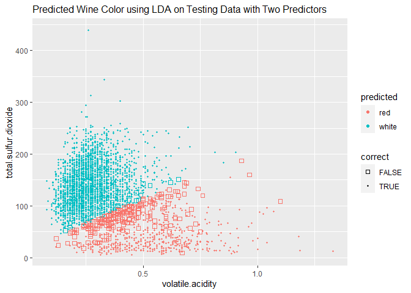

Project 4
================

**1. Load the two data sets into R**

``` r
library(readxl) 
library(tidyverse)
```

    ## ── Attaching packages ─────────────────────────────────────── tidyverse 1.3.2 ──
    ## ✔ ggplot2 3.4.0      ✔ purrr   1.0.1 
    ## ✔ tibble  3.1.8      ✔ dplyr   1.0.10
    ## ✔ tidyr   1.2.1      ✔ stringr 1.5.0 
    ## ✔ readr   2.1.3      ✔ forcats 0.5.2 
    ## ── Conflicts ────────────────────────────────────────── tidyverse_conflicts() ──
    ## ✖ dplyr::filter() masks stats::filter()
    ## ✖ dplyr::lag()    masks stats::lag()

``` r
library(MASS)
```

    ## 
    ## Attaching package: 'MASS'
    ## 
    ## The following object is masked from 'package:dplyr':
    ## 
    ##     select

``` r
library(FNN)
library(kableExtra)
```

    ## 
    ## Attaching package: 'kableExtra'
    ## 
    ## The following object is masked from 'package:dplyr':
    ## 
    ##     group_rows

``` r
quality_red.csv = read.csv("C:\\Users\\I566801\\OneDrive - SAP SE\\Documents\\Drexel\\MATH 318\\Week 4\\winequality-red.csv", sep = ";")
```

``` r
quality_white.csv = read.csv("C:\\Users\\I566801\\OneDrive - SAP SE\\Documents\\Drexel\\MATH 318\\Week 4\\winequality-white.csv", sep = ";")
```

**2. Transform data frames to tibble format**

``` r
quality_red.df = as_tibble(quality_red.csv) # casts to tibble type
```

``` r
quality_white.df = as_tibble(quality_white.csv) # casts to tibble type
```

**3. Add a column to each data frame**

``` r
quality_red.df = add_column(quality_red.df, color = "red")
```

``` r
quality_white.df = add_column(quality_white.df, color = "white")
```

**4. Split the data**

Sample 1000 indices randomly from the rows of two data frames
**`quality_red.df`** and **`quality_white.df`**.

``` r
train_red_idx <- sample(seq_len(nrow(quality_red.df)), size=1000)
train_white_idx <- sample(seq_len(nrow(quality_white.df)), size=1000)
```

Split red and white wine data

``` r
train_red.df <- quality_red.df[train_red_idx,]
train_white.df <- quality_white.df[train_red_idx,]
test_red.df <- quality_red.df[-train_red_idx,]
test_white.df <- quality_white.df[-train_white_idx,]
```

**5. Join data frames to have a training set and a testing set**

Training set includes 1000 random red wine samples and 1000 random white
wine samples (2000 in total)

``` r
train.df = union_all(train_red.df, train_white.df)
test.df = union_all(test_red.df, test_white.df)
```

**6. Plot the training data**

Convert `color` column into categorical type

``` r
train.df$color <- as.factor(train.df$color)
train.df
```

    ## # A tibble: 2,000 × 13
    ##    fixed…¹ volat…² citri…³ resid…⁴ chlor…⁵ free.…⁶ total…⁷ density    pH sulph…⁸
    ##      <dbl>   <dbl>   <dbl>   <dbl>   <dbl>   <dbl>   <dbl>   <dbl> <dbl>   <dbl>
    ##  1    13.2    0.38    0.55     2.7   0.081       5      16   1.00   2.98    0.54
    ##  2     9.8    0.51    0.19     3.2   0.081       8      30   0.998  3.23    0.58
    ##  3     7.5    0.63    0.27     2     0.083      17      91   0.996  3.26    0.58
    ##  4     6.9    0.54    0.04     3     0.077       7      27   0.999  3.69    0.91
    ##  5     6.6    0.61    0.01     1.9   0.08        8      25   0.997  3.69    0.73
    ##  6     5.4    0.58    0.08     1.9   0.059      20      31   0.995  3.5     0.64
    ##  7     8.9    0.4     0.32     5.6   0.087      10      47   0.999  3.38    0.77
    ##  8     7.1    0.62    0.06     1.3   0.07        5      12   0.994  3.17    0.48
    ##  9     6.8    0.63    0.12     3.8   0.099      16     126   0.997  3.28    0.61
    ## 10     9.9    0.74    0.19     5.8   0.111      33      76   0.999  3.14    0.55
    ## # … with 1,990 more rows, 3 more variables: alcohol <dbl>, quality <int>,
    ## #   color <fct>, and abbreviated variable names ¹​fixed.acidity,
    ## #   ²​volatile.acidity, ³​citric.acid, ⁴​residual.sugar, ⁵​chlorides,
    ## #   ⁶​free.sulfur.dioxide, ⁷​total.sulfur.dioxide, ⁸​sulphates

Run logistic regression

``` r
# Fit a logistic regression model to the training data
color.classifier <- glm(color~volatile.acidity+total.sulfur.dioxide, data=train.df, family = binomial)
```

Plot training data in terms of both volatile acidity and total sulfur
dioxide predictors, and add the decision boundary for the color data to
the plot as a line

``` r
betas <- color.classifier$coefficients # extract betas
p_t = 0.5 # threshold probability for Bayes decision boundary
intercept <- (log(p_t/(1-p_t)) - betas[1])/betas[3]
slope <- -betas[2]/betas[3]


scatter.plt <- ggplot(train.df,aes(color=color))
# Add the decision boundary to the plot as a line
scatter.plt <- scatter.plt + geom_abline(intercept=intercept ,slope=slope, color="red", linewidth=1.5) 
scatter.plt <- scatter.plt + geom_point(aes(volatile.acidity,total.sulfur.dioxide))

print(scatter.plt)
```

<!-- -->

I think the decision boundary does quite a good job in separating the
two classes. It shows a clear and quite well-defined decision boundary
between the two classes (red and white wines) appears in the plot.

The decision boundary does not have to be linear (by using different
models). However, in this case, I think a nonlinear boundary might be
unnecessary because the linear decision boundary is appropriate for
classifying the data.

**7. Logistic regression model**

Fit a logistic regression model to the training data

``` r
regression.model <- glm(color~volatile.acidity+total.sulfur.dioxide, data=train.df, family = binomial)
```

Get predicted probability of wine color on the testing data

``` r
glm.test.prob <-predict(regression.model, newdata=test.df, type="response")
```

Map probabilities to predictions of red or white wine

``` r
glm.test.pred <- rep("red", nrow(test.df))
glm.test.pred[glm.test.prob>0.5] <- "white"
```

Plots to display the predicted cases (red/white) for the logistic
classifier, using the `volatile.acidity` and `total.sulfur.dioxide`
predictors. The plot also use color to represent predicted class and
shape/size to distinguish between correct and incorrect predictions.

``` r
glm.test.df <- tibble(volatile.acidity = test.df$volatile.acidity, 
                      total.sulfur.dioxide = test.df$total.sulfur.dioxide, 
                      predicted = as.factor(glm.test.pred), 
                      truth = test.df$color, correct=(glm.test.pred==test.df$color
                      ) )

glm.test.plt <- ggplot(glm.test.df, 
                        aes(color=predicted, shape=correct,size=correct)) +
                 geom_point(aes(x=volatile.acidity, y=total.sulfur.dioxide)) + 
                 scale_shape_manual(values = c(0,20)) + 
                 scale_size_manual(values=c(2,1)) +
                 ggtitle("Predicted Wine Color using Logistic Regression on Testing Data with Two Predictors") +
                 theme(plot.title = element_text(size = 11))

print(glm.test.plt)
```

<!-- -->

Testing Error

``` r
table(glm.test.pred, test.df$color)
```

    ##              
    ## glm.test.pred  red white
    ##         red    571   211
    ##         white   28  3687

``` r
glm.test.err = mean(glm.test.pred != test.df$color)

sprintf("Testing Error Rate = %f", glm.test.err)
```

    ## [1] "Testing Error Rate = 0.053147"

Training Error

``` r
glm.train.prob <-predict(regression.model, newdata=train.df, type="response")
glm.train.pred <- rep("red", nrow(train.df))
glm.train.pred[glm.train.prob>0.5] <- "white"
  
table(glm.train.pred, train.df$color)
```

    ##               
    ## glm.train.pred red white
    ##          red   953    59
    ##          white  47   941

``` r
glm.train.err = mean(glm.train.pred != train.df$color)

sprintf("Testing Error Rate = %f", glm.train.err)
```

    ## [1] "Testing Error Rate = 0.053000"

**8. Linear Discriminant Analysis (LDA) model**

Fit a LDA model to the training data

``` r
lda.model <- lda(color~volatile.acidity+total.sulfur.dioxide, data = train.df)
```

Get predictions of wine color

``` r
lda.test.pred <-predict(lda.model, newdata=test.df)
lda.test.pred <- lda.test.pred$class
```

Plots to display the predicted cases (red/white) for the LDA classifier,
using the `volatile.acidity` and `total.sulfur.dioxide` predictors. The
plot also use color to represent predicted class and shape/size to
distinguish between correct and incorrect predictions.

``` r
lda.test.df <- tibble(volatile.acidity = test.df$volatile.acidity, 
                      total.sulfur.dioxide = test.df$total.sulfur.dioxide, 
                      predicted = as.factor(lda.test.pred), 
                      truth = test.df$color, correct=(lda.test.pred==test.df$color
                      ) )

lda.test.plt <- ggplot(lda.test.df, 
                        aes(color=predicted, shape=correct,size=correct)) +
                 geom_point(aes(x=volatile.acidity, y=total.sulfur.dioxide)) + 
                 scale_shape_manual(values = c(0,20)) + 
                 scale_size_manual(values=c(2,1)) + 
                 ggtitle("Predicted Wine Color using LDA on Testing Data with Two Predictors") +
                 theme(plot.title = element_text(size = 12))

print(lda.test.plt)
```

<!-- -->

Testing Error

``` r
table(lda.test.pred, test.df$color)
```

    ##              
    ## lda.test.pred  red white
    ##         red    572   231
    ##         white   27  3667

``` r
lda.test.err = mean(lda.test.pred != test.df$color)

sprintf("Testing Error Rate = %f", lda.test.err)
```

    ## [1] "Testing Error Rate = 0.057372"

Training Error

``` r
lda.train.pred <-predict(lda.model, newdata=train.df)
lda.train.pred <- lda.train.pred$class

table(lda.train.pred, train.df$color)
```

    ##               
    ## lda.train.pred red white
    ##          red   956    63
    ##          white  44   937

``` r
lda.train.err = mean(lda.train.pred != train.df$color)

sprintf("Testing Error Rate = %f", lda.train.err)
```

    ## [1] "Testing Error Rate = 0.053500"

**9. Quadratic Discriminant Analysis (QDA) model**

Fit a QDA model to the training data

``` r
qda.model <- qda(color~volatile.acidity+total.sulfur.dioxide, data = train.df)
```

Get predictions of wine color

``` r
qda.test.pred <-predict(qda.model, newdata=test.df)
qda.test.pred <- qda.test.pred$class
```

Plots to display the predicted cases (red/white) for the QDA classifier,
using the `volatile.acidity` and `total.sulfur.dioxide` predictors. The
plot also use color to represent predicted class and shape/size to
distinguish between correct and incorrect predictions.

``` r
qda.test.df <- tibble(volatile.acidity = test.df$volatile.acidity, 
                      total.sulfur.dioxide = test.df$total.sulfur.dioxide, 
                      predicted = as.factor(qda.test.pred), 
                      truth = test.df$color, correct=(qda.test.pred==test.df$color
                      ) )

qda.test.plt <- ggplot(qda.test.df, 
                        aes(color=predicted, shape=correct,size=correct)) +
                 geom_point(aes(x=volatile.acidity, y=total.sulfur.dioxide)) + 
                 scale_shape_manual(values = c(0,20)) + 
                 scale_size_manual(values=c(2,1)) + 
                 ggtitle("Predicted Wine Color using QDA on Testing Data with Two Predictors") +
                 theme(plot.title = element_text(size = 12))

print(qda.test.plt)
```

<!-- -->

Testing Error

``` r
table(qda.test.pred, test.df$color)
```

    ##              
    ## qda.test.pred  red white
    ##         red    574   235
    ##         white   25  3663

``` r
qda.test.err = mean(qda.test.pred != test.df$color)

sprintf("Testing Error Rate = %f", qda.test.err)
```

    ## [1] "Testing Error Rate = 0.057816"

Training data

``` r
qda.train.pred <-predict(qda.model, newdata=train.df)
qda.train.pred <- qda.train.pred$class

table(qda.train.pred, train.df$color)
```

    ##               
    ## qda.train.pred red white
    ##          red   951    68
    ##          white  49   932

``` r
qda.train.err = mean(qda.train.pred != train.df$color)

sprintf("Testing Error Rate = %f", qda.train.err)
```

    ## [1] "Testing Error Rate = 0.058500"

**10. KNN model with K = 3**

Trains a K-nearest neighbors (KNN) classifier with K=3 on the
`volatile.acidity` and `total.sulfur.dioxide` features of the training
data and applies the trained classifier on the test data to predict the
`color` label of each test sample.

``` r
knn3.test.pred <- knn(as.matrix(train.df[,c("volatile.acidity", "total.sulfur.dioxide")]), 
                     as.matrix(test.df[,c("volatile.acidity", "total.sulfur.dioxide")]), 
                     as.matrix(train.df$color), k=3) # 3 nearest neighbors

# display the number of correctly and incorrectly predicted samples
```

Plots to display the predicted cases (red/white) for the KNN classifier
with K=3, using the `volatile.acidity` and `total.sulfur.dioxide`
predictors. The plot also use color to represent predicted class and
shape/size to distinguish between correct and incorrect predictions.

``` r
knn3.test.df <- tibble(volatile.acidity = test.df$volatile.acidity, 
                      total.sulfur.dioxide = test.df$total.sulfur.dioxide, 
                      predicted = as.factor(knn3.test.pred), 
                      truth = test.df$color, correct=(knn3.test.pred==test.df$color
                      ) )

knn3.test.plt <- ggplot(knn3.test.df, 
                        aes(color=predicted, shape=correct,size=correct)) +
                 geom_point(aes(x=volatile.acidity, y=total.sulfur.dioxide)) + 
                 scale_shape_manual(values = c(0,20)) + 
                 scale_size_manual(values=c(2,1)) +
                 ggtitle("Predicted Wine Color using K-NN, K=3 on Testing Data with Two Predictors") +
                 theme(plot.title = element_text(size = 12))

print(knn3.test.plt)
```

<!-- -->

Testing Error

``` r
table(knn3.test.pred, test.df$color)
```

    ##               
    ## knn3.test.pred  red white
    ##          red    543   222
    ##          white   56  3676

``` r
knn3.test.err = mean(knn3.test.pred != test.df$color)

sprintf("Testing Error Rate = %f", knn3.test.err)
```

    ## [1] "Testing Error Rate = 0.061819"

Training Error

``` r
knn3.train.pred <- knn(as.matrix(train.df[,c("volatile.acidity", "total.sulfur.dioxide")]), 
                       as.matrix(train.df[,c("volatile.acidity", "total.sulfur.dioxide")]), 
                       as.matrix(train.df$color), k=3) # 3 nearest neighbors

table(knn3.train.pred, train.df$color)
```

    ##                
    ## knn3.train.pred red white
    ##           red   954    42
    ##           white  46   958

``` r
knn3.train.err = mean(knn3.train.pred != train.df$color)

sprintf("Testing Error Rate = %f", knn3.train.err)
```

    ## [1] "Testing Error Rate = 0.044000"

**11. KNN model with K = 9**

Train a K-nearest neighbors (KNN) classifier with K=9

``` r
knn9.test.pred <- knn(as.matrix(train.df[,c("volatile.acidity", "total.sulfur.dioxide")]), 
                     as.matrix(test.df[,c("volatile.acidity", "total.sulfur.dioxide")]), 
                     as.matrix(train.df$color), k=9) # 3 nearest neighbors
```

Plot to display the predicted cases (red/white) for the KNN classifier
with K=9

``` r
knn9.test.df <- tibble(volatile.acidity = test.df$volatile.acidity, 
                      total.sulfur.dioxide = test.df$total.sulfur.dioxide, 
                      predicted = as.factor(knn9.test.pred), 
                      truth = test.df$color, correct=(knn9.test.pred==test.df$color
                      ) )

knn9.test.plt <- ggplot(knn9.test.df, 
                        aes(color=predicted, shape=correct,size=correct)) +
                 geom_point(aes(x=volatile.acidity, y=total.sulfur.dioxide)) + 
                 scale_shape_manual(values = c(0,20)) + 
                 scale_size_manual(values=c(2,1)) +
                 ggtitle("Predicted Wine Color using K-NN, K=9 on Testing Data with Two Predictors") +
                 theme(plot.title = element_text(size = 12))

print(knn9.test.plt)
```

<!-- -->

Testing Error

``` r
table(knn9.test.pred, test.df$color)
```

    ##               
    ## knn9.test.pred  red white
    ##          red    529   231
    ##          white   70  3667

``` r
knn9.test.err = mean(knn9.test.pred != test.df$color)

sprintf("Testing Error Rate = %f", knn9.test.err)
```

    ## [1] "Testing Error Rate = 0.066934"

Training Error

``` r
knn9.train.pred <- knn(as.matrix(train.df[,c("volatile.acidity", "total.sulfur.dioxide")]), 
                       as.matrix(train.df[,c("volatile.acidity", "total.sulfur.dioxide")]), 
                       as.matrix(train.df$color), k=9) # 3 nearest neighbors

table(knn9.train.pred, train.df$color)
```

    ##                
    ## knn9.train.pred red white
    ##           red   892    55
    ##           white 108   945

``` r
knn9.train.err = mean(knn9.train.pred != train.df$color)

sprintf("Testing Error Rate = %f", knn9.train.err)
```

    ## [1] "Testing Error Rate = 0.081500"

**12. Report and discuss the training and testing errors in each case.
How do they compare?**

``` r
error.df <- data.frame(
  Classifier = c("Logistic", "LDA", "QDA", "KNN (K=3)", "KNN (K=9)"),
  Training_Error = c(glm.train.err, lda.train.err, qda.train.err, knn3.train.err, knn9.train.err),
  Testing_Error = c(glm.test.err, lda.test.err, qda.test.err, knn3.test.err, knn9.test.err)
)

error.table = kable(error.df, caption = "Training and testing errors for different classifiers")

kable_styling(error.table, bootstrap_options = "striped")
```

<table class="table table-striped" style="margin-left: auto; margin-right: auto;">
<caption>
Training and testing errors for different classifiers
</caption>
<thead>
<tr>
<th style="text-align:left;">
Classifier
</th>
<th style="text-align:right;">
Training_Error
</th>
<th style="text-align:right;">
Testing_Error
</th>
</tr>
</thead>
<tbody>
<tr>
<td style="text-align:left;">
Logistic
</td>
<td style="text-align:right;">
0.0530
</td>
<td style="text-align:right;">
0.0531465
</td>
</tr>
<tr>
<td style="text-align:left;">
LDA
</td>
<td style="text-align:right;">
0.0535
</td>
<td style="text-align:right;">
0.0573716
</td>
</tr>
<tr>
<td style="text-align:left;">
QDA
</td>
<td style="text-align:right;">
0.0585
</td>
<td style="text-align:right;">
0.0578163
</td>
</tr>
<tr>
<td style="text-align:left;">
KNN (K=3)
</td>
<td style="text-align:right;">
0.0440
</td>
<td style="text-align:right;">
0.0618190
</td>
</tr>
<tr>
<td style="text-align:left;">
KNN (K=9)
</td>
<td style="text-align:right;">
0.0815
</td>
<td style="text-align:right;">
0.0669335
</td>
</tr>
</tbody>
</table>

The training error is the lowest for KNN (K=3) while the highest
training error is for KNN (K=9). However, the testing error is the
lowest for logistic regression, while the highest testing error is for
KNN (K=9).

Logistic regression has the lowest testing error. This indicates that it
performs the best on unseen data, while KNN (K=9) has the highest
testing error, indicating that it may be overfitting to the training
data.

Overall, the results suggest that logistic regression is the best
classifier for this particular problem, followed by QDA and LDA, while
KNN with K=9 is the worst.
