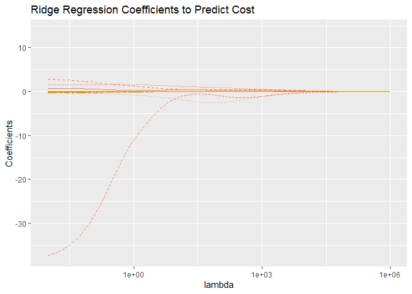
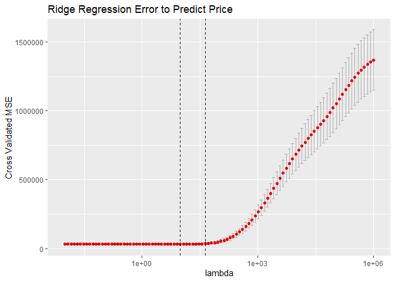
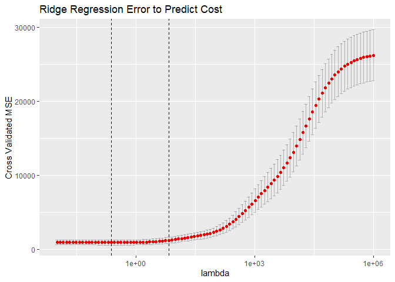
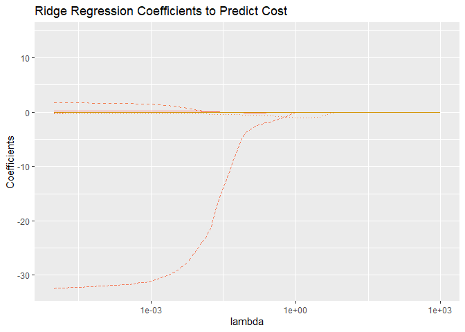

Project 5
================

#### 1. Load data set into R

``` r
library(readxl)
library(tidyverse)
```

    ## ── Attaching packages ─────────────────────────────────────── tidyverse 1.3.2 ──
    ## ✔ ggplot2 3.4.0      ✔ purrr   1.0.1 
    ## ✔ tibble  3.1.8      ✔ dplyr   1.0.10
    ## ✔ tidyr   1.2.1      ✔ stringr 1.5.0 
    ## ✔ readr   2.1.3      ✔ forcats 0.5.2 
    ## ── Conflicts ────────────────────────────────────────── tidyverse_conflicts() ──
    ## ✖ dplyr::filter() masks stats::filter()
    ## ✖ dplyr::lag()    masks stats::lag()

``` r
library(kableExtra)
```

    ## 
    ## Attaching package: 'kableExtra'
    ## 
    ## The following object is masked from 'package:dplyr':
    ## 
    ##     group_rows

``` r
library(boot)
library(caret)
```

    ## Loading required package: lattice
    ## 
    ## Attaching package: 'lattice'
    ## 
    ## The following object is masked from 'package:boot':
    ## 
    ##     melanoma
    ## 
    ## 
    ## Attaching package: 'caret'
    ## 
    ## The following object is masked from 'package:purrr':
    ## 
    ##     lift

``` r
library(glmnet)
```

    ## Loading required package: Matrix
    ## 
    ## Attaching package: 'Matrix'
    ## 
    ## The following objects are masked from 'package:tidyr':
    ## 
    ##     expand, pack, unpack
    ## 
    ## Loaded glmnet 4.1-6

``` r
hw5.xlsx = read_excel("C:\\Users\\I566801\\OneDrive - SAP SE\\Documents\\Drexel\\MATH 318\\Homework 5\\Residential-Building-Data-Set.xlsx", sheet="Data", skip=1)
```

    ## New names:
    ## • `V-11` -> `V-11...13`
    ## • `V-12` -> `V-12...14`
    ## • `V-13` -> `V-13...15`
    ## • `V-14` -> `V-14...16`
    ## • `V-15` -> `V-15...17`
    ## • `V-16` -> `V-16...18`
    ## • `V-17` -> `V-17...19`
    ## • `V-18` -> `V-18...20`
    ## • `V-19` -> `V-19...21`
    ## • `V-20` -> `V-20...22`
    ## • `V-21` -> `V-21...23`
    ## • `V-22` -> `V-22...24`
    ## • `V-23` -> `V-23...25`
    ## • `V-24` -> `V-24...26`
    ## • `V-25` -> `V-25...27`
    ## • `V-26` -> `V-26...28`
    ## • `V-27` -> `V-27...29`
    ## • `V-28` -> `V-28...30`
    ## • `V-29` -> `V-29...31`
    ## • `V-11` -> `V-11...32`
    ## • `V-12` -> `V-12...33`
    ## • `V-13` -> `V-13...34`
    ## • `V-14` -> `V-14...35`
    ## • `V-15` -> `V-15...36`
    ## • `V-16` -> `V-16...37`
    ## • `V-17` -> `V-17...38`
    ## • `V-18` -> `V-18...39`
    ## • `V-19` -> `V-19...40`
    ## • `V-20` -> `V-20...41`
    ## • `V-21` -> `V-21...42`
    ## • `V-22` -> `V-22...43`
    ## • `V-23` -> `V-23...44`
    ## • `V-24` -> `V-24...45`
    ## • `V-25` -> `V-25...46`
    ## • `V-26` -> `V-26...47`
    ## • `V-27` -> `V-27...48`
    ## • `V-28` -> `V-28...49`
    ## • `V-29` -> `V-29...50`
    ## • `V-11` -> `V-11...51`
    ## • `V-12` -> `V-12...52`
    ## • `V-13` -> `V-13...53`
    ## • `V-14` -> `V-14...54`
    ## • `V-15` -> `V-15...55`
    ## • `V-16` -> `V-16...56`
    ## • `V-17` -> `V-17...57`
    ## • `V-18` -> `V-18...58`
    ## • `V-19` -> `V-19...59`
    ## • `V-20` -> `V-20...60`
    ## • `V-21` -> `V-21...61`
    ## • `V-22` -> `V-22...62`
    ## • `V-23` -> `V-23...63`
    ## • `V-24` -> `V-24...64`
    ## • `V-25` -> `V-25...65`
    ## • `V-26` -> `V-26...66`
    ## • `V-27` -> `V-27...67`
    ## • `V-28` -> `V-28...68`
    ## • `V-29` -> `V-29...69`
    ## • `V-11` -> `V-11...70`
    ## • `V-12` -> `V-12...71`
    ## • `V-13` -> `V-13...72`
    ## • `V-14` -> `V-14...73`
    ## • `V-15` -> `V-15...74`
    ## • `V-16` -> `V-16...75`
    ## • `V-17` -> `V-17...76`
    ## • `V-18` -> `V-18...77`
    ## • `V-19` -> `V-19...78`
    ## • `V-20` -> `V-20...79`
    ## • `V-21` -> `V-21...80`
    ## • `V-22` -> `V-22...81`
    ## • `V-23` -> `V-23...82`
    ## • `V-24` -> `V-24...83`
    ## • `V-25` -> `V-25...84`
    ## • `V-26` -> `V-26...85`
    ## • `V-27` -> `V-27...86`
    ## • `V-28` -> `V-28...87`
    ## • `V-29` -> `V-29...88`
    ## • `V-11` -> `V-11...89`
    ## • `V-12` -> `V-12...90`
    ## • `V-13` -> `V-13...91`
    ## • `V-14` -> `V-14...92`
    ## • `V-15` -> `V-15...93`
    ## • `V-16` -> `V-16...94`
    ## • `V-17` -> `V-17...95`
    ## • `V-18` -> `V-18...96`
    ## • `V-19` -> `V-19...97`
    ## • `V-20` -> `V-20...98`
    ## • `V-21` -> `V-21...99`
    ## • `V-22` -> `V-22...100`
    ## • `V-23` -> `V-23...101`
    ## • `V-24` -> `V-24...102`
    ## • `V-25` -> `V-25...103`
    ## • `V-26` -> `V-26...104`
    ## • `V-27` -> `V-27...105`
    ## • `V-28` -> `V-28...106`
    ## • `V-29` -> `V-29...107`

``` r
hw5.df = as_tibble(hw5.xlsx) # casts to tibble type
print(hw5.df)
```

    ## # A tibble: 372 × 109
    ##    START YE…¹ START…² COMPL…³ COMPL…⁴ `V-1` `V-2` `V-3`  `V-4` `V-5` `V-6` `V-7`
    ##         <dbl>   <dbl>   <dbl>   <dbl> <dbl> <dbl> <dbl>  <dbl> <dbl> <dbl> <dbl>
    ##  1         81       1      85       1     1  3150   920  598.    190 1011.    16
    ##  2         84       1      89       4     1  7600  1140 3040     400  964.    23
    ##  3         78       1      81       4     1  4800   840  480     100  690.    15
    ##  4         72       2      73       2     1   685   202   13.7    20  460.     4
    ##  5         87       1      90       2     1  3000   800 1230     410  632.    13
    ##  6         87       1      90       1     1  2500   640 1050     420  647.    12
    ##  7         87       2      90       1     1  1810   492 1158.    640  844.    11
    ##  8         88       1      89       3     1  1150   380  575     500  591.     6
    ##  9         76       3      77       4     1  2110   540  190.     90  732.     5
    ## 10         80       1      80       4     1  3030   930  515.    170 1007.     3
    ## # … with 362 more rows, 98 more variables: `V-8` <dbl>, `V-11...13` <dbl>,
    ## #   `V-12...14` <dbl>, `V-13...15` <dbl>, `V-14...16` <dbl>, `V-15...17` <dbl>,
    ## #   `V-16...18` <dbl>, `V-17...19` <dbl>, `V-18...20` <dbl>, `V-19...21` <dbl>,
    ## #   `V-20...22` <dbl>, `V-21...23` <dbl>, `V-22...24` <dbl>, `V-23...25` <dbl>,
    ## #   `V-24...26` <dbl>, `V-25...27` <dbl>, `V-26...28` <dbl>, `V-27...29` <dbl>,
    ## #   `V-28...30` <dbl>, `V-29...31` <dbl>, `V-11...32` <dbl>, `V-12...33` <dbl>,
    ## #   `V-13...34` <dbl>, `V-14...35` <dbl>, `V-15...36` <dbl>, …

**2. Briefly summarize what the data set reports**

The dataset comprises 29 attributes `V-1` to `V-29` measured for each
project. Among that:

Response variables are

- `V-9` : actual sales price

- `V-10` : actual construction cost

The predictors include

- `V-1` to `V-8` : project physical and financial variables

- `V-11` to `V-29` : economic variables and indices measured at five
  different time lags

**3. Apply ordinary least squares to predict the actual sales price and
the actual construction cost**

Having separate data frame for each case

``` r
buildings.price = hw5.df[-109]
buildings.cost = hw5.df[-108]
```

Fit regression model to the data

``` r
glm.fit.price = glm(`V-9`~., data=buildings.price)
glm.fit.cost = glm(`V-10`~., data=buildings.cost)
```

When we try to predict using the model, it returns the warning as below:

``` r
glm.price.pred <- predict(glm.fit.price, newdata=buildings.price, type="response")
```

    ## Warning in predict.lm(object, newdata, se.fit, scale = 1, type = if (type == :
    ## prediction from a rank-deficient fit may be misleading

This is because we are trying to fit a linear regression model with
multicollinear variables.

Multicollinearity occurs when two or more predictor variables in a
regression model are highly correlated with each other, making it
difficult to determine the individual effect of each variable on the
outcome variable.

**4. Estimate MSE using 10 fold Cross-Validation:**

``` r
# K=10
cv.err.price = cv.glm(data=buildings.price, glm.fit.price, K=10)
```

    ## Warning in predict.lm(object, newdata, se.fit, scale = 1, type = if (type == :
    ## prediction from a rank-deficient fit may be misleading

    ## Warning in predict.lm(object, newdata, se.fit, scale = 1, type = if (type == :
    ## prediction from a rank-deficient fit may be misleading

    ## Warning in predict.lm(object, newdata, se.fit, scale = 1, type = if (type == :
    ## prediction from a rank-deficient fit may be misleading

    ## Warning in predict.lm(object, newdata, se.fit, scale = 1, type = if (type == :
    ## prediction from a rank-deficient fit may be misleading

    ## Warning in predict.lm(object, newdata, se.fit, scale = 1, type = if (type == :
    ## prediction from a rank-deficient fit may be misleading

    ## Warning in predict.lm(object, newdata, se.fit, scale = 1, type = if (type == :
    ## prediction from a rank-deficient fit may be misleading

    ## Warning in predict.lm(object, newdata, se.fit, scale = 1, type = if (type == :
    ## prediction from a rank-deficient fit may be misleading

    ## Warning in predict.lm(object, newdata, se.fit, scale = 1, type = if (type == :
    ## prediction from a rank-deficient fit may be misleading

    ## Warning in predict.lm(object, newdata, se.fit, scale = 1, type = if (type == :
    ## prediction from a rank-deficient fit may be misleading

    ## Warning in predict.lm(object, newdata, se.fit, scale = 1, type = if (type == :
    ## prediction from a rank-deficient fit may be misleading

    ## Warning in predict.lm(object, newdata, se.fit, scale = 1, type = if (type == :
    ## prediction from a rank-deficient fit may be misleading

    ## Warning in predict.lm(object, newdata, se.fit, scale = 1, type = if (type == :
    ## prediction from a rank-deficient fit may be misleading

    ## Warning in predict.lm(object, newdata, se.fit, scale = 1, type = if (type == :
    ## prediction from a rank-deficient fit may be misleading

    ## Warning in predict.lm(object, newdata, se.fit, scale = 1, type = if (type == :
    ## prediction from a rank-deficient fit may be misleading

    ## Warning in predict.lm(object, newdata, se.fit, scale = 1, type = if (type == :
    ## prediction from a rank-deficient fit may be misleading

    ## Warning in predict.lm(object, newdata, se.fit, scale = 1, type = if (type == :
    ## prediction from a rank-deficient fit may be misleading

    ## Warning in predict.lm(object, newdata, se.fit, scale = 1, type = if (type == :
    ## prediction from a rank-deficient fit may be misleading

    ## Warning in predict.lm(object, newdata, se.fit, scale = 1, type = if (type == :
    ## prediction from a rank-deficient fit may be misleading

    ## Warning in predict.lm(object, newdata, se.fit, scale = 1, type = if (type == :
    ## prediction from a rank-deficient fit may be misleading

    ## Warning in predict.lm(object, newdata, se.fit, scale = 1, type = if (type == :
    ## prediction from a rank-deficient fit may be misleading

``` r
cv.err.cost = cv.glm(data=buildings.cost, glm.fit.cost, K=10)
```

    ## Warning in predict.lm(object, newdata, se.fit, scale = 1, type = if (type == :
    ## prediction from a rank-deficient fit may be misleading

    ## Warning in predict.lm(object, newdata, se.fit, scale = 1, type = if (type == :
    ## prediction from a rank-deficient fit may be misleading

    ## Warning in predict.lm(object, newdata, se.fit, scale = 1, type = if (type == :
    ## prediction from a rank-deficient fit may be misleading

    ## Warning in predict.lm(object, newdata, se.fit, scale = 1, type = if (type == :
    ## prediction from a rank-deficient fit may be misleading

    ## Warning in predict.lm(object, newdata, se.fit, scale = 1, type = if (type == :
    ## prediction from a rank-deficient fit may be misleading

    ## Warning in predict.lm(object, newdata, se.fit, scale = 1, type = if (type == :
    ## prediction from a rank-deficient fit may be misleading

    ## Warning in predict.lm(object, newdata, se.fit, scale = 1, type = if (type == :
    ## prediction from a rank-deficient fit may be misleading

    ## Warning in predict.lm(object, newdata, se.fit, scale = 1, type = if (type == :
    ## prediction from a rank-deficient fit may be misleading

    ## Warning in predict.lm(object, newdata, se.fit, scale = 1, type = if (type == :
    ## prediction from a rank-deficient fit may be misleading

    ## Warning in predict.lm(object, newdata, se.fit, scale = 1, type = if (type == :
    ## prediction from a rank-deficient fit may be misleading

    ## Warning in predict.lm(object, newdata, se.fit, scale = 1, type = if (type == :
    ## prediction from a rank-deficient fit may be misleading

    ## Warning in predict.lm(object, newdata, se.fit, scale = 1, type = if (type == :
    ## prediction from a rank-deficient fit may be misleading

    ## Warning in predict.lm(object, newdata, se.fit, scale = 1, type = if (type == :
    ## prediction from a rank-deficient fit may be misleading

    ## Warning in predict.lm(object, newdata, se.fit, scale = 1, type = if (type == :
    ## prediction from a rank-deficient fit may be misleading

    ## Warning in predict.lm(object, newdata, se.fit, scale = 1, type = if (type == :
    ## prediction from a rank-deficient fit may be misleading

    ## Warning in predict.lm(object, newdata, se.fit, scale = 1, type = if (type == :
    ## prediction from a rank-deficient fit may be misleading

    ## Warning in predict.lm(object, newdata, se.fit, scale = 1, type = if (type == :
    ## prediction from a rank-deficient fit may be misleading

    ## Warning in predict.lm(object, newdata, se.fit, scale = 1, type = if (type == :
    ## prediction from a rank-deficient fit may be misleading

    ## Warning in predict.lm(object, newdata, se.fit, scale = 1, type = if (type == :
    ## prediction from a rank-deficient fit may be misleading

    ## Warning in predict.lm(object, newdata, se.fit, scale = 1, type = if (type == :
    ## prediction from a rank-deficient fit may be misleading

MSE estimation of the models:

``` r
mse.vals.price = cv.err.price$delta[1]
sprintf("MSE value of the price-predicting model: %g", mse.vals.price)
```

    ## [1] "MSE value of the price-predicting model: 8.2199e+26"

``` r
mse.vals.cost = cv.err.cost$delta[1]
sprintf("MSE value of the cost-predicting model: %g", mse.vals.cost)
```

    ## [1] "MSE value of the cost-predicting model: 7.56817e+27"

Using cross-validated mean squared error (MSE) for each model to get the
MSE values for the price-predicting model and cost-predicting model.

These values are very large, indicating that the models are not fitting
the data well (the models are likely making large prediction errors).
Therefore, it does not seem reasonable to use these models for
predicting prices or costs of buildings

**5. Apply ridge regression and LASSO to, separately, predict the actual
sales price and the actual construction cost.**

To use `glmnet` for Ridge Regression, we need to extract the design
matrix and store it as a matrix:

``` r
X.price <- model.matrix(`V-9`~., data=buildings.price)[,-1]
X.cost <- model.matrix(`V-10`~., data=buildings.cost)[,-1]
# -1 omits the first column, corresponding to the intercept
```

**Note:** `` `V-9`~. `` specifies that `V-9` is the response variable,
and **`.`** indicates that all other variables in the data frame
`buildings.price` should be used as predictors. Same method for the
other design matrix. The resulting matrix includes columns for the
intercept (already taken off) as well as the other predictor variables.

**5.1 Ridge Regression**

Run Ridge regression on a whole range of $\lambda$ values, since we do
not know which one is “right.”

``` r
low = -2;
high = 6;
lambda.grid <- 10^seq(low, high, length = 100)
```

Fit a ridge regression model with a range of values for the penalty
parameter `lambda`.

``` r
V9 = buildings.price$`V-9` # extract the column
ridge.fit.price <- glmnet(X.price, V9, alpha = 0, lambda = lambda.grid) #ridge: alpha=0
```

``` r
V10 = buildings.cost$`V-10` # extract the column
ridge.fit.cost <- glmnet(X.cost, V10, alpha = 0, lambda = lambda.grid) #ridge: alpha=0
```

Get the coefficients and store in a data frame:

``` r
# price
beta.price <-as.matrix(coef(ridge.fit.price))
beta.price.df <- as_tibble(beta.price)
beta.price.df$coef <- row.names(beta.price)
#beta.price.df
```

``` r
# cost
beta.cost <-as.matrix(coef(ridge.fit.cost))
beta.cost.df <- as_tibble(beta.cost)
beta.cost.df$coef <- row.names(beta.cost)
#beta.cost.df
```

Reformat the data

``` r
# price
# spread out
beta.price.df.long <- gather(beta.price.df, key=case, value,-coef)
# relabel columns
beta.price.df.long$case <- as.integer(gsub("s", "", beta.price.df.long$case))
beta.price.df.long$lambda <-ridge.fit.price$lambda[beta.price.df.long$case+1]
#beta.price.df.long
```

``` r
# cost
# spread out
beta.cost.df.long <- gather(beta.cost.df, key=case, value,-coef)
# relabel columns
beta.cost.df.long$case <- as.integer(gsub("s", "", beta.cost.df.long$case))
beta.cost.df.long$lambda <-ridge.fit.cost$lambda[beta.cost.df.long$case+1]
#beta.cost.df.long
```

Visualize the coefficients as a function of `lambda`

``` r
# plot all coefficients
beta.price.plt <- ggplot(beta.price.df.long[beta.price.df.long$coef!="(Intercept)",], 
                   aes(x=lambda, y=value, color = coef, linetype = coef)) + 
  geom_line() + theme(legend.position="none") +
  scale_x_log10()  + ggtitle("Ridge Regression Coefficients to Predict Price") + ylab("Coefficients")
print(beta.price.plt)
```

<!-- -->

``` r
# plot all coefficients
beta.cost.plt <- ggplot(beta.cost.df.long[beta.cost.df.long$coef!="(Intercept)",], 
                   aes(x=lambda, y=value, color = coef, linetype = coef)) + 
  geom_line() + theme(legend.position="none") +
  scale_x_log10()  + ggtitle("Ridge Regression Coefficients to Predict Cost") + ylab("Coefficients")
print(beta.cost.plt)
```

<!-- -->

Run cross validation MSE with K=10 and visualize:

``` r
set.seed(200)
cv.ridge.price <- cv.glmnet(X.price, V9, alpha = 0, lambda = lambda.grid, K=10)

# visualize using ggplot2
cv.ridge.price.df <- tibble(lambda=cv.ridge.price$lambda, cvm=cv.ridge.price$cvm,
cvlo=cv.ridge.price$cvlo, cvup=cv.ridge.price$cvup)

cv.ridge.price.plt <- ggplot(cv.ridge.price.df) + geom_point(aes(x=lambda,y=cvm),color="red") +
                      geom_errorbar(aes(x=lambda, ymin=cvlo, ymax=cvup),alpha = .25) +
                      geom_vline(xintercept = cv.ridge.price$lambda.min, linetype = "dashed") +
                      geom_vline(xintercept = cv.ridge.price$lambda.1se, linetype = "dashed") +
                      ggtitle("Ridge Regression Error to Predict Price") +
                      ylab("Cross Validated MSE") +
                      scale_x_log10()

print(cv.ridge.price.plt)
```

<!-- -->

``` r
set.seed(200)
cv.ridge.cost <- cv.glmnet(X.cost, V10, alpha = 0, lambda = lambda.grid, K=10)

# visualize using ggplot2
cv.ridge.cost.df <- tibble(lambda=cv.ridge.cost$lambda, cvm=cv.ridge.cost$cvm,
cvlo=cv.ridge.cost$cvlo, cvup=cv.ridge.cost$cvup)

cv.ridge.cost.plt <- ggplot(cv.ridge.cost.df) + geom_point(aes(x=lambda,y=cvm),color="red") +
                      geom_errorbar(aes(x=lambda, ymin=cvlo, ymax=cvup),alpha = .25) +
                      geom_vline(xintercept = cv.ridge.cost$lambda.min, linetype = "dashed") +
                      geom_vline(xintercept = cv.ridge.cost$lambda.1se, linetype = "dashed") +
                      ggtitle("Ridge Regression Error to Predict Cost") +
                      ylab("Cross Validated MSE") +
                      scale_x_log10()

print(cv.ridge.cost.plt)
```

<!-- -->

**Note:**

- lambda.min is marked with the dashed vertical line on the left

- lambda.1se is marked with the dashed vertical line on the right

**Discussion**

``` r
cv.ridge.price
```

    ## 
    ## Call:  cv.glmnet(x = X.price, y = V9, lambda = lambda.grid, alpha = 0,      K = 10) 
    ## 
    ## Measure: Mean-Squared Error 
    ## 
    ##     Lambda Index Measure   SE Nonzero
    ## min   9.77    63   30844 5763     107
    ## 1se  43.29    55   34937 7720     107

- Lambda min is 9.77. This is the lambda value that gave the smallest
  MSE.

- Lambda 1se is 43.29. This is lambda value that gave the lambda value
  that gave an MSE within one standard error of the minimum MSE.

In this case, the optimal lambda value would be l`ambda.min` = 9.77,
since it gave the smallest MSE without having a more complex model
because both lambda values share same the number of nonzero coefficients
(same number of predictors = 107).

``` r
cv.ridge.cost
```

    ## 
    ## Call:  cv.glmnet(x = X.cost, y = V10, lambda = lambda.grid, alpha = 0,      K = 10) 
    ## 
    ## Measure: Mean-Squared Error 
    ## 
    ##     Lambda Index Measure    SE Nonzero
    ## min  0.236    83     933 327.9     107
    ## 1se  6.734    65    1245 410.4     107

- Lambda min is 0.236. This is the lambda value that gave the smallest
  MSE.

- Lambda 1se is 6.734. This is lambda value that gave the lambda value
  that gave an MSE within one standard error of the minimum MSE.

In this case, the optimal lambda value would be l`ambda.min` = 0.236,
since it gave the smallest MSE without having a more complex model
because both lambda values share same the number of nonzero coefficients
(same number of predictors = 107).

**5.2 LASSO Regression**

``` r
low = -5;
high = 3;
lambda.grid <- 10^seq(low, high, length = 100)
```

Fit a ridge regression model with a range of values for the penalty
parameter `lambda`.

``` r
lasso.fit.price <- glmnet(X.price, V9, alpha = 1, lambda = lambda.grid) #lasso: alpha=1
```

``` r
lasso.fit.cost <- glmnet(X.cost, V10, alpha = 1, lambda = lambda.grid) #lasso: alpha=1
```

Get the coefficients and store in a data frame:

``` r
# price
beta.price <-as.matrix(coef(lasso.fit.price))
beta.price.df <- as_tibble(beta.price)
beta.price.df$coef <- row.names(beta.price)
#beta.price.df
```

``` r
# cost
beta.cost <-as.matrix(coef(lasso.fit.cost))
beta.cost.df <- as_tibble(beta.cost)
beta.cost.df$coef <- row.names(beta.cost)
#beta.cost.df
```

Reformat the data

``` r
# price
# spread out
beta.price.df.long <- gather(beta.price.df, key=case, value,-coef)
# relabel columns
beta.price.df.long$case <- as.integer(gsub("s", "", beta.price.df.long$case))
beta.price.df.long$lambda <-lasso.fit.price$lambda[beta.price.df.long$case+1]
#beta.price.df.long
```

``` r
# cost
# spread out
beta.cost.df.long <- gather(beta.cost.df, key=case, value,-coef)
# relabel columns
beta.cost.df.long$case <- as.integer(gsub("s", "", beta.cost.df.long$case))
beta.cost.df.long$lambda <-lasso.fit.cost$lambda[beta.cost.df.long$case+1]
#beta.cost.df.long
```

Visualize the coefficients as a function of `lambda`

``` r
# plot all coefficients
beta.price.plt <- ggplot(beta.price.df.long[beta.price.df.long$coef!="(Intercept)",], 
                   aes(x=lambda, y=value, color = coef, linetype = coef)) + 
  geom_line() + theme(legend.position="none") +
  scale_x_log10()  + ggtitle("Ridge Regression Coefficients to Predict Price") + ylab("Coefficients")
print(beta.price.plt)
```

<!-- -->

``` r
# plot all coefficients
beta.cost.plt <- ggplot(beta.cost.df.long[beta.cost.df.long$coef!="(Intercept)",], 
                   aes(x=lambda, y=value, color = coef, linetype = coef)) + 
  geom_line() + theme(legend.position="none") +
  scale_x_log10()  + ggtitle("Ridge Regression Coefficients to Predict Cost") + ylab("Coefficients")
print(beta.cost.plt)
```

<!-- -->

Run cross validation MSE with K=10 and visualize:

``` r
set.seed(200)
cv.lasso.price <- cv.glmnet(X.price, V9, alpha = 1, lambda = lambda.grid, K=10)

# visualize using ggplot2
cv.lasso.price.df <- tibble(lambda=cv.lasso.price$lambda, cvm=cv.lasso.price$cvm,
cvlo=cv.lasso.price$cvlo, cvup=cv.lasso.price$cvup)

cv.lasso.price.plt <- ggplot(cv.lasso.price.df) + geom_point(aes(x=lambda,y=cvm),color="red") +
                      geom_errorbar(aes(x=lambda, ymin=cvlo, ymax=cvup),alpha = .25) +
                      geom_vline(xintercept = cv.lasso.price$lambda.min, linetype = "dashed") +
                      geom_vline(xintercept = cv.lasso.price$lambda.1se, linetype = "dashed") +
                      ggtitle("LASSO Regression Error to Predict Price") +
                      ylab("Cross Validated MSE") +
                      scale_x_log10()

print(cv.lasso.price.plt)
```

<!-- -->

``` r
set.seed(200)
cv.lasso.cost <- cv.glmnet(X.cost, V10, alpha = 1, lambda = lambda.grid, K=10)

# visualize using ggplot2
cv.lasso.cost.df <- tibble(lambda=cv.lasso.cost$lambda, cvm=cv.lasso.cost$cvm,
cvlo=cv.lasso.cost$cvlo, cvup=cv.lasso.cost$cvup)

cv.lasso.cost.plt <- ggplot(cv.lasso.cost.df) + geom_point(aes(x=lambda,y=cvm),color="red") +
                      geom_errorbar(aes(x=lambda, ymin=cvlo, ymax=cvup),alpha = .25) +
                      geom_vline(xintercept = cv.lasso.cost$lambda.min, linetype = "dashed") +
                      geom_vline(xintercept = cv.lasso.cost$lambda.1se, linetype = "dashed") +
                      ggtitle("LASSO Regression Error to Predict Cost") +
                      ylab("Cross Validated MSE") +
                      scale_x_log10()

print(cv.lasso.cost.plt)
```

<!-- -->

**Discussion**

``` r
cv.lasso.price
```

    ## 
    ## Call:  cv.glmnet(x = X.price, y = V9, lambda = lambda.grid, alpha = 1,      K = 10) 
    ## 
    ## Measure: Mean-Squared Error 
    ## 
    ##     Lambda Index Measure   SE Nonzero
    ## min  2.595    33   27445 5772      31
    ## 1se 11.498    25   31194 7594      20

- Lambda min is 2.595. This is the lambda value that gave the smallest
  MSE.

- Lambda 1se is 11.498. This is lambda value that gave the lambda value
  that gave an MSE within one standard error of the minimum MSE.

In this case, the optimal lambda value would be l`ambda.min` = 11.498,
since it gave the smallest MSE.

However, this results in a more complex model with more non-zero
coefficients (number of predictors = 31), which may result in
overfitting.

``` r
cv.lasso.cost
```

    ## 
    ## Call:  cv.glmnet(x = X.cost, y = V10, lambda = lambda.grid, alpha = 1,      K = 10) 
    ## 
    ## Measure: Mean-Squared Error 
    ## 
    ##     Lambda Index Measure    SE Nonzero
    ## min  0.043    55   924.3 321.0      64
    ## 1se  6.579    28  1226.8 348.9       9

- Lambda min is 0.043. This is the lambda value that gave the smallest
  MSE.

- Lambda 1se is 6.579. This is lambda value that gave the lambda value
  that gave an MSE within one standard error of the minimum MSE.

In this case, the optimal lambda value would be l`ambda.min` = 0.0.043,
since it gave the smallest MSE.

However, this results in a more complex model with more non-zero
coefficients (number of predictors = 64), which may result in
overfitting.

**Comparison**

Comparison of MSE and Nonzero Entries for Cost:

``` r
cost_data <- data.frame(
  Model = c("Ridge", "LASSO", "OLS"),
  MSE = c(933, 924.3, 1.73105e+24),
  Nonzero = c(107, 64, 107)
)
kable(cost_data, caption = "Comparison of MSE and Nonzero Entries for Cost") %>%
  kable_styling(bootstrap_options = "striped")
```

<table class="table table-striped" style="margin-left: auto; margin-right: auto;">
<caption>
Comparison of MSE and Nonzero Entries for Cost
</caption>
<thead>
<tr>
<th style="text-align:left;">
Model
</th>
<th style="text-align:right;">
MSE
</th>
<th style="text-align:right;">
Nonzero
</th>
</tr>
</thead>
<tbody>
<tr>
<td style="text-align:left;">
Ridge
</td>
<td style="text-align:right;">
9.33000e+02
</td>
<td style="text-align:right;">
107
</td>
</tr>
<tr>
<td style="text-align:left;">
LASSO
</td>
<td style="text-align:right;">
9.24300e+02
</td>
<td style="text-align:right;">
64
</td>
</tr>
<tr>
<td style="text-align:left;">
OLS
</td>
<td style="text-align:right;">
1.73105e+24
</td>
<td style="text-align:right;">
107
</td>
</tr>
</tbody>
</table>

Comparison of MSE and Nonzero Entries for Price:

``` r
price_data <- data.frame(
  Model = c("Ridge", "LASSO", "OLS"),
  MSE = c(30844, 27445, 1.7568e+28),
  Nonzero = c(107, 31, 107)
)

kable(price_data, caption = "Comparison of MSE and Nonzero Entries for Price") %>%
  kable_styling(bootstrap_options = "striped") 
```

<table class="table table-striped" style="margin-left: auto; margin-right: auto;">
<caption>
Comparison of MSE and Nonzero Entries for Price
</caption>
<thead>
<tr>
<th style="text-align:left;">
Model
</th>
<th style="text-align:right;">
MSE
</th>
<th style="text-align:right;">
Nonzero
</th>
</tr>
</thead>
<tbody>
<tr>
<td style="text-align:left;">
Ridge
</td>
<td style="text-align:right;">
3.0844e+04
</td>
<td style="text-align:right;">
107
</td>
</tr>
<tr>
<td style="text-align:left;">
LASSO
</td>
<td style="text-align:right;">
2.7445e+04
</td>
<td style="text-align:right;">
31
</td>
</tr>
<tr>
<td style="text-align:left;">
OLS
</td>
<td style="text-align:right;">
1.7568e+28
</td>
<td style="text-align:right;">
107
</td>
</tr>
</tbody>
</table>

**Conclusion**

Based on the comparison tables, the LASSO model seems to be the best
option for both cost and price prediction, as it has the lowest MSE for
both variables and a relatively low number of nonzero entries compared
to the other models. The OLS model performs very poorly in terms of MSE
and should be avoided.

**5. You will find that LASSO has relatively few nonzero entries at the
optimal choice of λ for both sales price and construction cost. Do these
correspond to the same predictors? Which ones?**

``` r
lasso.price.coef <- predict(lasso.fit.price, type = "coefficients", s = cv.lasso.price$lambda.min)
lasso.cost.coef <- predict(lasso.fit.cost, type = "coefficients", s = cv.lasso.cost$lambda.min)
```

``` r
# Get the indices of predictors with non-zero coefficients for price and cost
lasso.price_preds <- which(lasso.price.coef != 0)
lasso.cost_preds <- which(lasso.cost.coef != 0)

# Get the common predictors indices between price and cost
common_preds <- intersect(lasso.price_preds, lasso.cost_preds)

print(common_preds)
```

    ##  [1]   1   3   6   7   8   9  10  12  13  21  22  26  32  36  40  41  42  49  52
    ## [20]  57  59  60  71  76  83  90  99 102

The above list indicates the shared predictors of LASSO for both sales
price and construction cost at the optimal λ choice.
