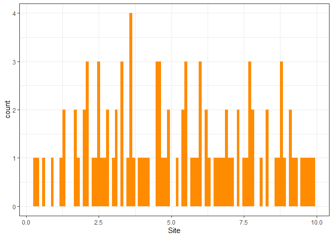
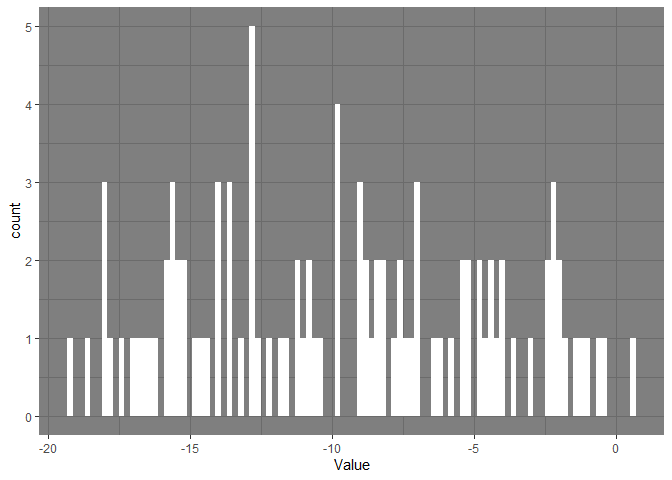
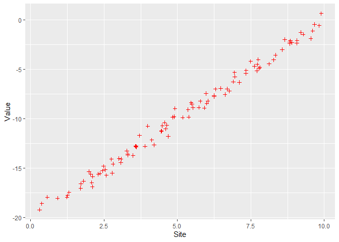

Homework 1 - MATH 318
================
Bao Dang

**1. Download the data set hw1.csv.**

``` r
library(readxl) # part of tidyverse
```

``` r
hw1.csv = read.csv("C:\\Users\\I566801\\OneDrive - SAP SE\\Documents\\Drexel\\MATH 318\\Week 1\\hw1.csv")
```

**2. Load the data sets into R as a data frame**

``` r
library(tidyverse)
```

    ## ── Attaching packages ─────────────────────────────────────── tidyverse 1.3.2 ──
    ## ✔ ggplot2 3.4.0      ✔ purrr   1.0.1 
    ## ✔ tibble  3.1.8      ✔ dplyr   1.0.10
    ## ✔ tidyr   1.2.1      ✔ stringr 1.5.0 
    ## ✔ readr   2.1.3      ✔ forcats 0.5.2 
    ## ── Conflicts ────────────────────────────────────────── tidyverse_conflicts() ──
    ## ✖ dplyr::filter() masks stats::filter()
    ## ✖ dplyr::lag()    masks stats::lag()

``` r
hw1.df = as_tibble(hw1.csv) # casts to tibble type
print(hw1.df)
```

    ## # A tibble: 100 × 2
    ##     Site  Value
    ##    <dbl>  <dbl>
    ##  1 3.08  -14.1 
    ##  2 2.58  -15.7 
    ##  3 5.52   -8.86
    ##  4 0.564 -17.9 
    ##  5 4.69  -11.8 
    ##  6 4.84   -9.83
    ##  7 8.12   -4.45
    ##  8 3.70  -11.7 
    ##  9 5.47   -8.38
    ## 10 1.70  -17.0 
    ## # … with 90 more rows

**3. What are the names of variables? How many samples are there in this
dataset?**

- Variable names: Site, Value.

- Number of samples: 100

**4. Find the 80% percentile value for each of the variables in the data
set.**

``` r
quantile(hw1.df$Site, .8) # get the 80% percentile value of 'Site'
```

    ##    80% 
    ## 7.7534

This indicates 7.7534 is higher than 80% of other values of Site.

``` r
quantile(hw1.df$Value, .8) # get the 80% percentile value of 'Value'
```

    ##       80% 
    ## -4.487722

This indicates -4.487722 is higher than 80% of other values of ‘Value’

**5. Using ggplot2 with this data frame, plot a histogram of each of the
variables, using different themes for each of the plots.**

``` r
library(ggplot2)
```

``` r
ggplot(data = hw1.df, mapping = aes(x = Site)) + geom_histogram(binwidth = .1, fill = "darkorange") + theme_bw()
```

<!-- -->

``` r
ggplot(data = hw1.df, mapping = aes(x = Value)) + geom_histogram(binwidth = .2, fill = "white") + theme_dark()
```

<!-- -->

**6. Plot the data set as a scatter plot (using geom_point) with filled
red pluses as the markers.**

``` r
ggplot(data = hw1.df) + geom_point(mapping = aes(x = Site, y = Value), shape = 3, color="red") + theme_grey()
```

<!-- -->

Data follow a linear trend line which shows Value value is increasing at
a steady rate as Site value increases.
